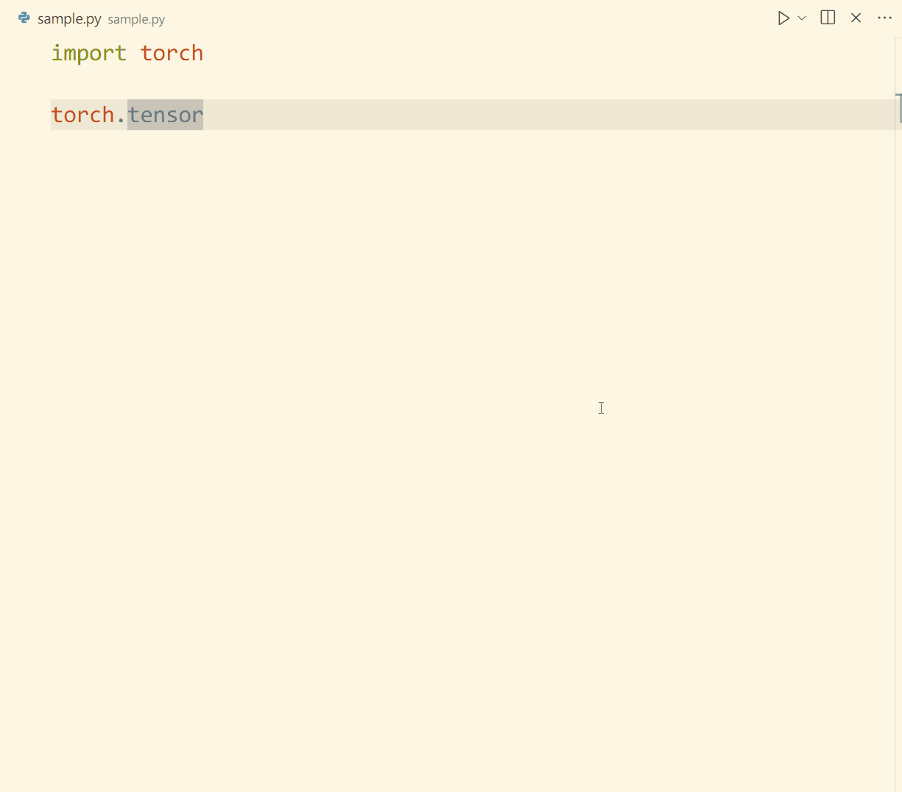
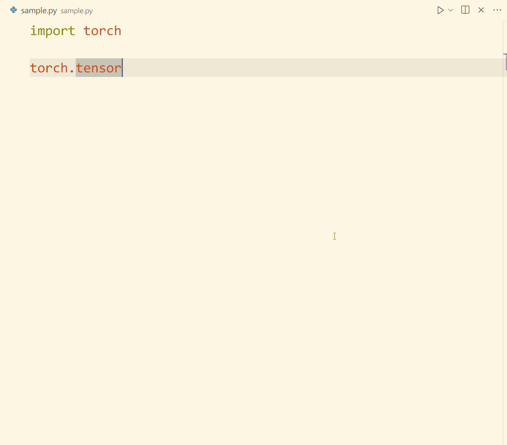

# Noted API

将你的笔记和API通过简洁的方式绑定在一起。

## 效果预览

### 为API创建笔记

对于新学习的API，可以快速为其创建笔记，记录此API的使用方法和特性。

### 打开API的笔记

对于编辑器光标处指向的API，如果已有笔记，可以直接打开。推荐为此命令绑定趁手的快捷键。

### 查看API的悬停提示

笔记将为对应的API提供悬停提示，以方便浏览数月之前的项目代码。

### 根据笔记简介搜索API

笔记的第3行将成为API的简介。在搜索API时，即使想不起API的名称，还可以根据简介片段搜索。

### 切换文档

根据需要，可以将笔记保存在不同的文档中，并随时切换当前文档。

## 设置

| 配置项             | 描述             |
| ------------------ | ---------------- |
| docDir             | 文档存放的路径。 |
| defaultSelectedDoc | 默认选择的文档。 |

## Enjoy!

config